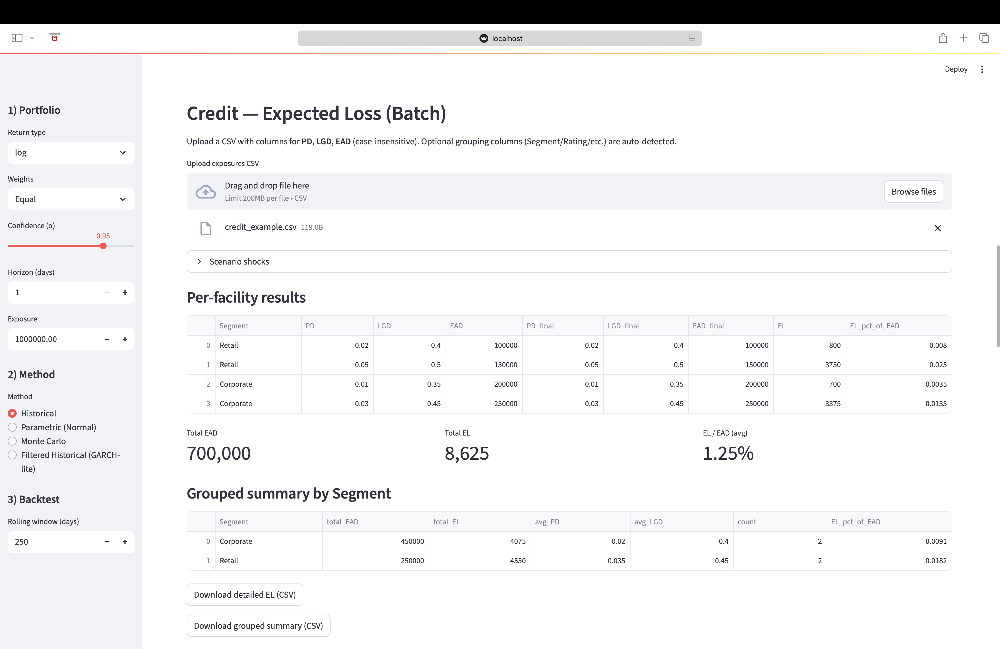

# Integrated Risk App (Python)

Model Risk Validation Sandbox for Market & Credit Risk (Python)

This project is a model-risk–oriented risk analytics engine designed to measure, validate, and document market and credit risk models in a manner consistent with institutional risk management and model validation practices.

The focus is not on building a dashboard, but on demonstrating rigorous risk modeling, backtesting, and governance-aware design, with clear assumptions, diagnostics, and limitations.

## 🎯 Project Objective (North Star)

Build a validation-ready risk engine that computes core risk measures (VaR, ES, Expected Loss) and evaluates their reliability using standard model risk diagnostics.

This repository is structured to resemble how pensions, model risk teams, and risk consultancies organize and review quantitative risk models.

## 📌 Scope (What This Project Intentionally Covers)
Market Risk

Value-at-Risk (VaR) and Expected Shortfall (ES)

Methods:

Historical Simulation

Parametric (Normal)

Monte Carlo

Filtered Historical (GARCH-lite)

Rolling window estimation

Backtesting using Kupiec Proportion-of-Failures (POF) test

Multi-confidence-level calibration (e.g. 95%, 99%)

Credit Risk

Expected Loss (EL) framework:

Probability of Default (PD)

Loss Given Default (LGD)

Exposure at Default (EAD)

Batch portfolio-level aggregation

Segment-level loss breakdown for monitoring

Stress & Scenario Analysis

Deterministic equity shocks

Interest-rate shocks using duration approximations

Correlation stress

Historical window replay

## 🚫 Out of Scope (By Design)

To preserve clarity and rigor, this project does not attempt to be:

A trading or portfolio optimization system

A real-time production risk engine

A regulatory-approved model

Advanced extensions (e.g. factor models, ALM, optimization) are intentionally deferred.

🖥 Application Interface

A lightweight Streamlit interface is provided only as a viewer to:

Run models with selected parameters

Visualize backtests and stress results

Inspect outputs interactively

All core modeling logic resides outside the UI to ensure separation between model logic and presentation.

**Live Demo:** <https://integrated-risk-app.onrender.com/>

📸 Example Outputs

Market Risk Backtesting (VaR & Exceptions)
Daily portfolio returns plotted against the VaR threshold.
Red points represent exceedances used in Kupiec backtesting.

Credit Risk – Expected Loss (Batch)
Aggregated EL with breakdown by segment, illustrating portfolio-level credit exposure.
  


## 🧠 Methodology Overview

VaR: loss threshold exceeded with probability 
1
−
𝛼
1−α

Expected Shortfall: average loss conditional on VaR exceedance

Kupiec POF Test: statistical test for unconditional coverage

Filtered Historical Simulation: volatility-adjusted return filtering

Expected Loss: 
PD
×
LGD
×
EAD
PD×LGD×EAD

All models follow a loss-based convention (risk measures reported as positive loss values).

## 🧪 Validation & Testing Philosophy

This project emphasizes model validation, not just model output.

Unit tests verify:

Monotonicity of VaR across confidence levels

ES ≥ VaR under consistent loss conventions

Correct behavior of backtesting logic

Credit EL aggregation consistency

Backtesting results are interpretable and reproducible

Assumptions and limitations are explicitly acknowledged

## ⚙️ Tech Stack

Python — core modeling language

Streamlit — lightweight interface

Pandas / NumPy — data handling and numerical computation

SciPy / Statsmodels — statistical modeling

Plotly — interactive visualization

yfinance — market data (demo use only)

## ⚡ Quickstart

```bash
git clone https://github.com/sensor-aae/Integrated-Risk-App.git
cd Integrated-Risk-App

python -m venv .venv
source .venv/bin/activate   # Windows: .venv\Scripts\activate

pip install -r requirements.txt
streamlit run app/app.py
```

Demo datasets are included so the app can be explored immediately.

## 📄 Documentation

A Model Risk Report (methodology, assumptions, validation results, and limitations) is maintained in the /docs directory and is intended to mirror institutional model documentation standards.

## ⚠️ Disclaimer

This project is for educational and demonstrative purposes only.
It is not intended for production use or investment decision-making.

## ⭐ Why This Project Exists

This repository is designed as a work sample for roles in:

Risk Analytics

Model Risk / Model Validation

Credit Risk

Pension & Institutional Investment Risk

Risk Consulting

It reflects how quantitative risk models are built, tested, challenged, and documented — not just how they are computed.
An interactive **Streamlit web app** that brings together **market risk** and **credit risk** analytics in one tool — built from scratch in Python.  
It demonstrates the ability to design, code, and validate professional risk models, including VaR/ES, backtesting, stress testing, and credit Expected Loss.


