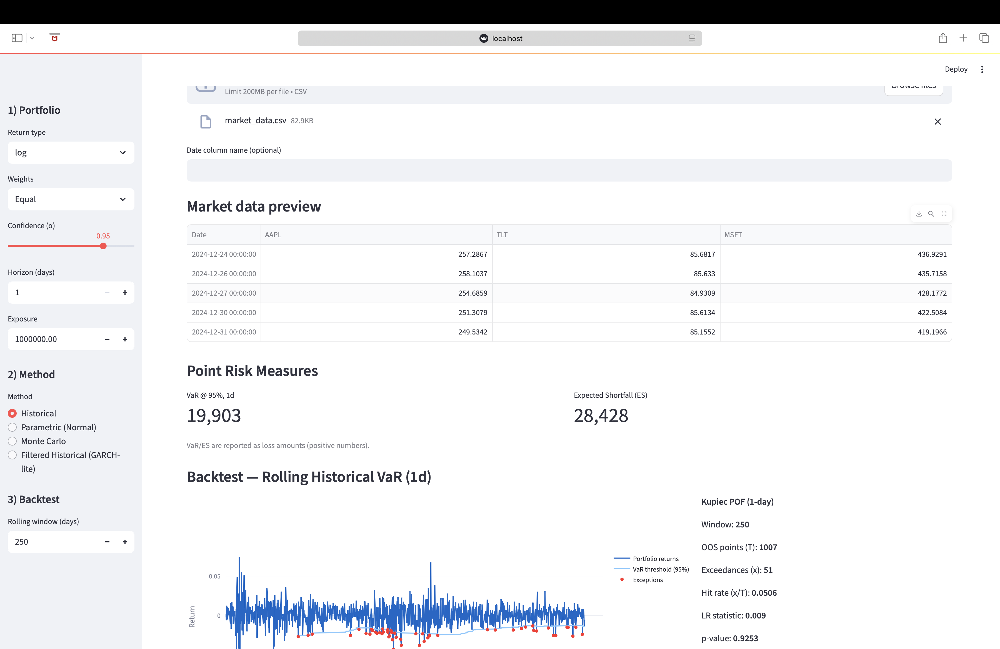

# Integrated Risk App (Python)

An interactive **Streamlit web app** that brings together **market risk** and **credit risk** analytics in one tool — built from scratch in Python.  
It demonstrates the ability to design, code, and validate professional risk models, including VaR/ES, backtesting, stress testing, and credit Expected Loss.

## 📸 Screenshots  

**1. Market Risk Backtest (VaR & Exceptions)**  
  
*Shows daily portfolio returns vs. the 99% VaR threshold. Red dots = exceedances. Used to validate if the model’s predicted risk matches actual losses (Kupiec POF test).*

**2. Credit Risk — Expected Loss (Batch)**  
  
*Aggregates Probability of Default (PD), Loss Given Default (LGD), and Exposure at Default (EAD) across facilities. Displays total expected losses and a breakdown by segment, useful for monitoring credit portfolios.*

Interactive Streamlit app for market & credit risk:
- VaR/ES: Historical, Parametric (Normal), Monte Carlo, GARCH-lite (Filtered Historical)
- Backtesting: rolling VaR with Kupiec POF test + multi-alpha calibration
- Analytics: correlation heatmap, VaR decomposition, what-if weights
- Stress & Scenarios: equity shocks, rates (duration), correlation bumps, historical window replay
- Credit: Expected Loss (batch)
- Risk Budgeting: Equal Risk Contribution (ERC)

**Live Demo:** <https://integrated-risk-app.onrender.com/>

## ⚡ Quickstart

Clone the repo, install dependencies, and launch the app:

```bash
git clone https://github.com/sensor-aae/Integrated-Risk-App.git
cd Integrated-Risk-App
python -m venv .venv && source .venv/bin/activate   # Windows: .venv\Scripts\activate
pip install -r requirements.txt
streamlit run app/app.py
```
## 🛠 Tech Stack

- **Python** — core language for all risk modeling  
- **Streamlit** — interactive web app framework  
- **Pandas & NumPy** — data handling, returns, matrix math  
- **Plotly** — dynamic charts (backtests, stress tests, EL by segment)  
- **yfinance** — market data source for demo  
- **SciPy / Statsmodels** — statistics & GARCH-lite modeling

Demo CSVs are included in data/ so you can click around immediately.

## 📊 How it works

VaR = loss threshold at confidence level α.

ES = average loss beyond VaR.

Kupiec test = checks if exceedances match expectation.

FHS (GARCH-lite) = filters volatility for better tail calibration.

ERC weights = equalize each asset’s risk contribution.

## ⚠️ Disclaimer
For educational use only. Not investment advice.


